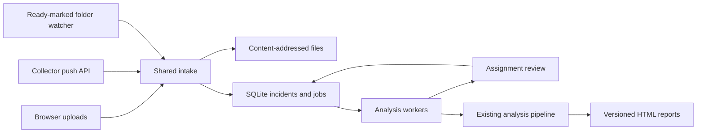

# Local application and integration guide

Built 2026-09-08. This application wraps the existing COMTRADE, DSP, fault
location, rules and incident-report pipeline with durable intake. Numerical
estimator equations are unchanged.

## Run locally

Double-click `start-local.cmd`, or run from PowerShell:

```powershell
cd 'E:\dr analyser'
.\start-local.ps1
```

Open **http://127.0.0.1:8091**. Ctrl+C in the launcher window stops the server.
First launch requires Python 3.11+ and internet access to create `.venv` and
install dependencies. Subsequent launches and analysis work offline. Use
`-Install` to refresh dependencies in an existing environment, or `-Port 8092`
to select another port. The older workbench remains on 8090.

For explicit installation in an activated Python environment:

```bash
python -m pip install -e '.[app]'
python -m dranalyser.application
```

The Windows launcher sets `OPENBLAS_NUM_THREADS=1`, required on this computer.
The module supplies that default when the variable is absent. The server binds
only to loopback. Runtime files are stored under `out/application` by default.

## Manual workflow

1. Choose **Upload records**, name the incident and select all records for that
   fault: ZIP, event folder, CFG/DAT pairs or CFF. Use terminal subfolders when
   the exports have identical filenames.
2. Background inspection checks the records. Confirm the line definition and
   each usable record's terminal and role. Select exactly one primary per
   available end. Other records can corroborate it or be explicitly excluded.
   Review **Protection system** separately: Main-1, Main-2, other or unknown.
   This identity is not inferred from terminal or analytical role.
3. Choose **Confirm & analyse**. View/download the incident report and inspect
   original file inventory, activity and revisions.
4. **Attach late records** creates a new revision containing old and new files;
   earlier reports remain available.
5. **Review & rerun** revises assignments or uses updated line definitions in a
   new revision. Failed jobs offer **Retry processing**.

Analysis without line constants can still assess protection behaviour. Existing
field definitions are provisional; their use does not establish operational
distance accuracy. The app does not silently correct CT/VT scaling or infer
terminal identities from file order.

## Per-relay evidence (2026-09-08 update)

Latest complete preview: **http://127.0.0.1:8099**, isolated
`out/application-native-preview`. Assignment review includes **Review channel
identities** for each parseable nonduplicate record. Choose explicit analog/digital
meanings (or ignore), supply a review reason, then confirm the assignment. Original
positions/labels and scaling stay visible. Corrected records pass conformance again;
unresolved blocks remain. **Restore automatic mapping** applies to a new revision.

In the navigator, narrow the local interval and choose **Load native samples**.
Previous/Next sample moves to exact recorded points. Inspection RMS/peak use the
inclusive display interval and do not change the original fault-window metrics.
Selections over 20,000 samples are refused with a narrower-interval instruction.
The revision-specific `/samples` endpoint and nested `channel_mapping` assignment
contract are documented in [CHANNEL_MAPPING_VALIDATION.md](CHANNEL_MAPPING_VALIDATION.md).
The earlier 8098 preview contains mapping review without native sample retrieval.

Previous navigation preview: **http://127.0.0.1:8097**, isolated
`out/application-navigation-final`. In an incident, choose **Open navigator**,
then a relay, analog channel, digital point and phase loop. Set local interval
bounds and move the cursor or use **Go to start** on an event. All views follow
that relay's time axis; switching relays resets it. **Export current view** saves
an additional standalone HTML snapshot without changing the incident report.
Ground loops/zone overlays, full-resolution zoom and physical breaker verdicts
remain unavailable. See [NAVIGATION_VALIDATION.md](NAVIGATION_VALIDATION.md).
This preview includes the final mixed-case timer and normalized-kV unit-label fixes.
Old revisions need **Review & rerun** on an updated backend to obtain navigator
data. The versioned endpoint is `/api/incidents/{id}/navigator?revision={number}`.
Earlier applications remain running; the 8096 intermediate preview predates the
unit-label fix. No original database or report was reset.

Previous checklist preview (2026-09-09): **http://127.0.0.1:8095**, isolated
`out/application-checklist-preview` data. It adds **Recording and philosophy
checklists** for every supplied relay, including unavailable/blocked records.
Select a **Recording reference profile** in assignment review: 132 kV distance,
132 kV backup or 220 kV+ distance; unconfirmed remains explicit. API assignments
accept optional `recording_profile` values `unconfirmed`, `wg3-132-distance`,
`wg3-132-backup` or `wg3-220plus-distance`. No profile is inferred from line
constants or selection as primary.

Place each RIO beside its relay record in a separate relay folder, or use exact
matching stems in a shared folder. A shared export covering multiple records,
or multiple versions for one relay, is ambiguous. Settings are never lent from
Main-1 to Main-2. File hashes/importer/missing fields are retained; association
does not establish device identity or event-time validity. Missing/unsupported
configuration and full coordination remain **not evaluable**. Late exports and
profile changes create new report revisions; old reports remain unchanged.
See [RECORDING_PHILOSOPHY_VALIDATION.md](RECORDING_PHILOSOPHY_VALIDATION.md).

Automatic approval review rejected the 8094 stop/restart with "blocked by policy";
8094 still runs the previous backend. Earlier comparison preview:
**http://127.0.0.1:8094**, isolated
`out/application-operation-preview` data. It runs without automatic code reload;
the Windows reloader did not replace its backend reliably during QA.
It adds **Operation comparisons and onset association**: expand a pair to inspect
both point observations and local durations. Correlation candidates are advisory;
their near-peak span is score sensitivity, not a confidence interval. Missing,
ambiguous, distorted or insufficient signals retain separate local timelines.
Conflicting observations get a **Review relay differences** warning above the
selected-record rule assessment. Previous revisions remain unchanged.
See [OPERATION_ASSOCIATION_VALIDATION.md](OPERATION_ASSOCIATION_VALIDATION.md) for
implemented behavior, unsupported cases and verification. Confirmed automatic
pairing, stage segmentation, clock-quality ingestion and global ordering remain pending.

Previous-milestone preview: **http://127.0.0.1:8093**, isolated data root
`out/application-evidence-preview`, with a labelled four-relay synthetic demo.
The existing application on 8091 and its two saved report revisions remain
unchanged. Automatic approval review blocked its stop/restart command, so that
process still has the earlier Python backend loaded. Loading the updated backend
on 8091 requires a normal server restart; no database reset or migration is needed.

The incident page and downloadable HTML now show all analysed relays, explicit
unavailable records, terminal availability and existing same-end comparisons.
Expand a relay to inspect its fault call, measurement window, raw channel names,
per-phase sample RMS, fundamental RMS, measured peak V/I and digital assertion
intervals. Units are primary A/V with declared scaling provenance. Sample RMS
includes DC/harmonics; no saturated-current reconstruction is performed.

Every valid recorder trigger is its own **0 ms** reference. Detected inception
is separate; equal trigger zeros do not synchronize the ends. Missing/invalid
trigger timestamps remain unavailable. Local trip timing is the first observed
trip edge after detected inception when identifiable, with nominal sampling
resolution shown. Missing points, nonasserted points, initially active points
and conflicting mappings have different evidence states. Trip commands do not
prove breaker opening. The summary rule verdict still uses selected records.

The fault-current summary and overcurrent ratio now use measured windowed RMS,
replacing a whole-record peak/sqrt(2) approximation. Old report revisions remain
unchanged. Use **Review & rerun** to produce per-relay evidence for an older
incident. The HTML has two summary sections and a variable-length all-relay
annex; printed output is not guaranteed to fit two physical pages.

Confirmed automatic event/stage association, full per-relay philosophy
adjudication, ground-loop/zone overlays and indexed large-record retrieval remain
planned. Reviewed channel mappings, bounded native waveform inspection, advisory
correlation, checklists and local SLD/channel/phase-loop navigation are implemented. See
[DR_OPERATIONAL_WORKFLOW_PLAN.md](DR_OPERATIONAL_WORKFLOW_PLAN.md).

## Watched folder integration

Point the collector/export script at `out/application/inbox`, with one completed
folder or ZIP per event:

```text
inbox/
  event-001/
    S/event.cfg
    S/event.dat
    R/event.cfg
    R/event.dat
    intake.json           optional
    .ready                create LAST, after closing all files
  event-002.zip
  event-002.zip.ready     create after completing the ZIP
```

The watcher scans every three seconds and retains source files. Persistent
receipts, including errors, appear under **Integrations**. After correcting a
rejected delivery, update its ready marker to retry. Do not modify a delivery
while it is being ingested. Use a new folder for late records.

Optional root-level `intake.json` declares authoritative assignments:

```json
{
  "line_id": "YOUR-REGISTRY-LINE-ID",
  "auto_analyse": true,
  "assignments": {
    "S/event.cfg": {"end": "S", "role": "primary", "protection_system": "Main-1"},
    "R/event.cfg": {"end": "R", "role": "primary", "protection_system": "Main-1"}
  }
}
```

Paths must match the exported paths relative to the event root. Set
`auto_analyse` only when assignments are authoritative. Missing/invalid
assignments wait for operator review. Include `incident_id` to attach a late
delivery to an existing incident. The collector or operator declares which
records belong together; autonomous electrical event pairing is not implemented.
`protection_system` is optional and defaults to unknown. Allowed values are
`unknown`, `Main-1`, `Main-2` and `other`.

## Push API integration

`GET /openapi.json` describes the routes. Mutations require the token from
`out/application/api-token.txt` in `X-DR-Token`. Example with PowerShell:

```powershell
$intakeToken = (Get-Content -Raw 'out/application/api-token.txt').Trim()
curl.exe -X POST 'http://127.0.0.1:8091/api/intake' `
  -H "X-DR-Token: $intakeToken" `
  -F 'source=api' -F 'name=Collector event 001' `
  -F 'files=@C:/exports/event-001.zip'
```

HTTP 202 returns `incident_id`, `revision`, `state` and `duplicate` after durable
intake. Processing continues asynchronously. Poll
`GET /api/incidents/{incident_id}`; download its report from
`GET /api/incidents/{incident_id}/report?revision=1`.

Optional multipart fields are `metadata` (JSON), `incident_id` and
`expected_revision`. Explicit metadata overrides the embedded manifest. Send
`expected_revision` on late deliveries to detect concurrent changes; HTTP 409
means refresh the incident. Identical content/metadata retries deduplicate.
Changing content at an existing filename is refused; use distinct folders.

Request/expanded-content limits are 400 MB and 2,000 files. Unsafe archive paths,
symlinks, encrypted entries and duplicate names are refused. Original expanded
files are stored by SHA-256; the ZIP container itself is not retained.

## Architecture and scaling



The default server runs two embedded workers. Separate serving and computation:

```powershell
.venv/Scripts/python.exe -m dranalyser.application --workers 0
# Run in another terminal with the same working directory:
.venv/Scripts/python.exe -m dranalyser.application worker
```

Workers must use the same `--root` and `--registry`. Atomic claims prevent
duplicate ownership. Heartbeats renew a 60-second lease; restarted workers
recover expired jobs. Attempt-specific directories and ownership checks prevent
stale workers from publishing. Completed revisions retain results, source files
and the line definition used for analysis.

This supports multiple workers **on one computer with a local disk**. SQLite WAL
is not a network-share or multi-host queue. Horizontal deployment still needs
a database such as PostgreSQL, shared object storage, job coordination and
deployment authentication. Direct IEC 61850/SFTP/vendor relay collectors remain
site-specific adapters to implement against these intake interfaces.

Patrol ground-truth capture still uses the separate `dranalyse capture` tool.
The legacy report's default `http://dr/confirm/...` address is a deployment
placeholder; it is not connected to this local application yet.

There is no automatic deletion or retention policy. Monitor disk usage. Back up
the entire root with all server/workers stopped, or use SQLite's backup API with
a consistent file-store copy. `out/` is gitignored. Keep integration tokens local.

## Repository review and verification

| Finding | Implemented response |
|---|---|
| Workbench analysis occupied HTTP requests | Durable queue and independent analysis workers |
| No shared collector/manual intake boundary | Common validation, storage and deduplication |
| Late records and restarts needed persistent state | SQLite jobs and preserved report revisions |
| Concurrent workers could overwrite results | Atomic claims, leases and fenced publication |
| RIO exports followed first-terminal iteration order | Settings associate separately with each record by matching folder/stem or unique folder; ambiguity is reported |
| Field constants remain incomplete | Provisional/unverified labels and explicit assignment review |

Initial application verification on 2026-09-08 (before the evidence extension):

- Full regression suite: **316 passed**, one upstream TestClient deprecation warning.
- Architecture guard and its self-tests: passed. New modules have explicit line budgets.
- Ruff on added Python modules/tests and JavaScript syntax check: passed.
- Stage-A in the app's fresh virtual environment: **10,000 cases**, clean p95
  **0.4403%**, pass. Across all located cases p95 is **11.470%**; 71 cases produce
  no location. This does not establish field accuracy.
- Chrome: upload, explicit assignments, report viewing and rerun passed with no
  JavaScript errors. Desktop/mobile screenshots are in `out/qa`.
- Tests exercise late two-ended revisions, actual E5 reports, API/folder intake,
  concurrent retries, lease recovery, stale ownership, unsafe ZIPs, corrupt files,
  assignment conflicts and settings association.

A clearly labelled synthetic demonstration incident is present in the local
workspace. Its browser-generated report uses no field line constants.
Generate fresh demo exports with `python scripts/create_demo.py`. For a numerical
demo, copy the generated `synthetic-line.yaml` into a separate registry directory
and launch with `--registry` pointing there; do not treat it as a field definition.

The supplied CIGRE TB 854 document is mapped in
[CIGRE_TB854_METHODS.md](CIGRE_TB854_METHODS.md). This application does not claim
that every method in that publication has been implemented.

Evidence extension verification: **384 tests passed** (one upstream TestClient
deprecation warning), architecture guard/self-tests and Stage-A **10,000 cases**
passed; clean p95 **0.4403%**, all-located p95 **11.470%**, 71 refusals. Added tests
exercise distorted/DC/clipped/missing measurements, trigger offsets and invalid
references, raw-point ambiguity, four-relay identity/revisions and unavailable
records. Isolated headless Edge checks passed for desktop/mobile display,
identity review/rerun and the all-relay report, with no JavaScript errors or
mobile page overflow. The Chrome bridge could not initialize in this session.
This is bounded software evidence, not completed TB 854 or field validation.

## Reviewed ground loops and zone boundaries (2026-09-10)

The completed isolated preview is http://127.0.0.1:8100, incident
`b81c038543ca4aefa3ddc1fd9f707fe6`, revision 4 (`out/application-rx-preview`).
The original 8091 application and earlier previews retain their data/backends.

In assignment review, open **Review R-X inputs** for a uniquely associated
settings export. Supply the reviewer, supporting evidence and only the
confirmations established by that evidence. Optional settings CT/VT ratios refer
to the export's secondary-ohm base. Blank ratios withhold boundaries; unconfirmed
zero-sequence VT support withholds AG/BG/CG. Save channel mapping changes before
reviewing these inputs. **Impedance loop** selects AB/BC/CA/AG/BG/CG in the navigator.
Ground-loop and zone input evidence is retained in browser and HTML exports.

See [RX_INPUT_VALIDATION.md](RX_INPUT_VALIDATION.md) for the `rx_review` metadata
contract, source/mapping invalidation, refusal semantics and 509-test evidence.
This adds a display workflow, not verified field settings or a new protection
verdict. Source settings API/document, SAP/GIS and confirmed stage/clock contracts
remain pending.
